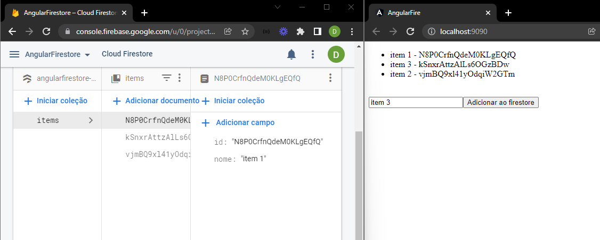
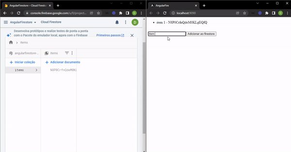

<p align="center">
  
</p>

<h1 align="center">AngularFire - Hello World!</h1>

## Qual o objetivo deste projeto? 🤔

O objetivo era construir uma aplicação utilizando o [AngularFire](https://github.com/angular/angularfire), a biblioteca oficial para aplicações Angular que facilita a comunicação/conexão/manipulação de dados com o banco de dados NoSQL do [Firebase](https://firebase.google.com/?hl=pt-br)<br /> <br />

<div align="center">
  <br>
    
  <br>
</div>

## O que foi desenvolvido? 🚀

Foi criado um "Hello World", uma aplicação Angular que recupera e cadastra "itens" diretamente no banco Firebase utilizando a biblioteca AngularFire. Assim que o item é cadastrado ele também é atualizado com uma coluna "id" preenchido de forma randômica que o banco Firebase gera após a criação do documento.

## Demonstração 🎥



## Tecnologias usadas 📚

- Angular 12
- AngularFire
- FireBase
- SASS

## Desenvolvimento 🎬

Clonando o repositório:

```
git clone https://github.com/DanielSoaresRocha/AngularFire-HelloWorld.git
```

Navegando até a pasta do repositório:

```
cd AngularFire
```

Baixando as dependências

```
npm i
```

ou

```
yarn
```

Rodando o projeto

execute `npm run start` ou `yarn start` no terminal

## License 📝

This project is licensed under the [MIT License](https://opensource.org/licenses/MIT) - see the [LICENSE](LICENSE) file for details.

## Autor

<table>
  <tr>
    <td align="center"><a href="https://github.com/DanielSoaresRocha"><br /><sub><b>Daniel Soares</b></sub></a><br /><a href="https://github.com/DanielSoaresRocha/ESIG-challenge/commits?author=DanielSoaresRocha" title="Code">💻</a></td>
  <tr>
</table>
